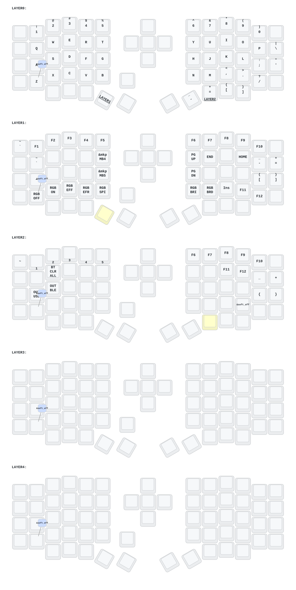

# Sofle

- [中文](README.md)
- [English](README_EN.md)

## 更新列表

- 2024/12/21
  1. 增加zmk-studio支持（只需要刷新左手即可使用）。
- 2024/10/24
  1. 修改供电模式，功耗降低。
  2. 修正RGB供电自动关闭的功能。
- 2025/3/30 增加睡眠进入时间1小时  增加防抖时间 优化睡眠后功耗 
- 2025/8/22
  1. 更新了soft off。当您同时按下 Q、S 和 Z 键并按住 2 秒钟时，键盘将进入深度睡眠状态，无法通过按键唤醒。携带外出时可以使用此功能。激活方式为按一次复位开关。
  2. 这个月，我还更新了矮轴版本sofle和corne的外壳。框架和底板加厚了，复位开关的开口也进行了调整，可以轻松按下复位开关。目前，我们仍在构思如何设计带有倾斜支架的外壳。如果您仔细检查过 PCB，您会注意到有用于扩展 IO 的预留接口。不知道有没有人能够使用它们，我会尝试一下！
  3. 右侧键盘屏幕上的GIF动画被移除，这将显著降低右侧键盘的功耗。

-2026/6/22 键盘支持DYA STUDIO改键了中文用户联系店主索取中文版DYA STUDIO安装包。这个上位机软件改键比ZMK studio更好用。

> 请更新最新的固件。
>

## 联系我

如需3D打印的模型文件或者键盘有任何异常和故障，请联系380465425@qq.com

## Sofle键位图



## Codex 用量右屏（本 fork）

本 fork 为 Eyelash Sofle 的右侧 nice!view 增加 Codex 用量页面：

- 与 Codex 桌面端保持同一数据维度：显示主配额的剩余百分比、窗口、进度条和本地重置日期/时间。
- 右屏顶栏保留 nice!view 原生的右侧电池、充电状态和分体无线连接样式；配额窗口与 `LEFT` 同行显示。
- 左手保留 ZMK/DYA Studio，并可通过加密 BLE GATT 或独立 USB CDC 通道接收 Codex 快照。
- 左手经 ZMK 蓝牙分体协议把快照转发给右手；账号凭据不会进入键盘。
- 电脑端桥接程序只调用本机 Codex app-server，默认每 60 秒刷新。

刷入本 fork 生成的左右固件后，可先运行一次验证：

```sh
python3 host/codex_usage_bridge.py --once
```

仅检查 Codex 数据而不访问键盘：

```sh
python3 host/codex_usage_bridge.py --once --dry-run
```

桥接程序会用 `CX1?` 握手自动识别专用串口，不会把数据误发给 ZMK Studio 通道。
macOS 登录自启动模板位于
`macos/com.openai.eyelash-sofle-codex-usage.plist.template`。

测试：

```sh
python3 -m unittest discover -s tests -v
```
